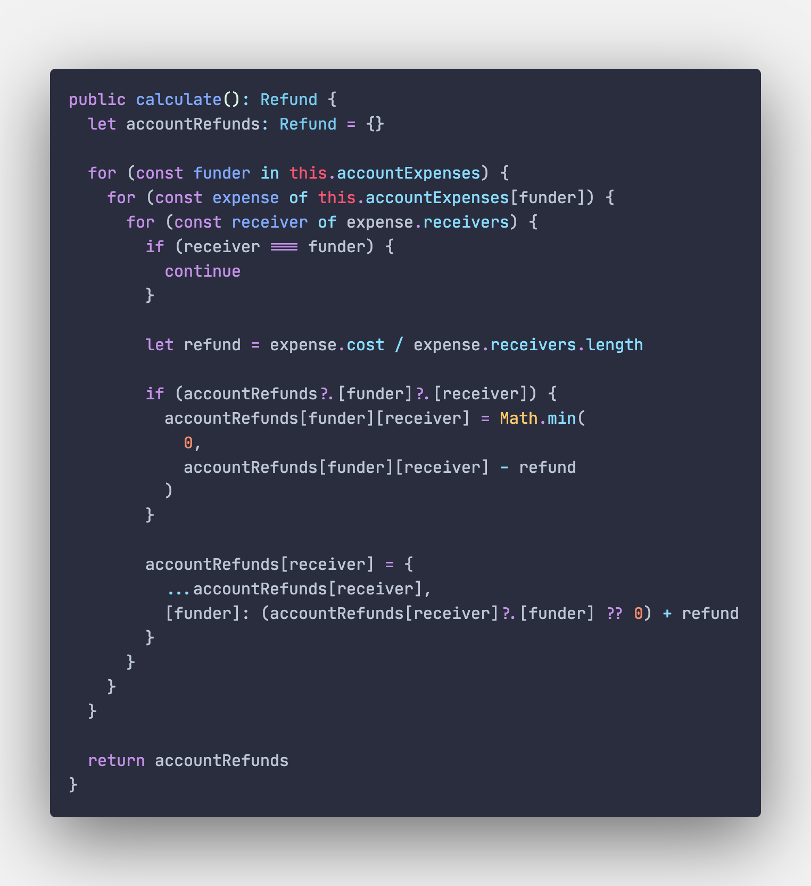

# Vaquant Expense Balance

## Use cases

- this packages exports a method that tells who need to refund who to balance a set of expenses.

## TODO

- [ ] give the refund to balance expences between accounts
- [ ] set weight in expense
- [ ] minimize transactions between accounts
- [ ] enable multiple currencies
- [ ] deal with big numbers
- [ ] deal with float numbers

## Experiences

- my mind is ahead of the tests. I'm already thinking about how I want to minimize the number of transactions instead of just passing my test in green even even though the use case isn't in the TODO list. Because I already know that the actual implementation will have to change.
  - one feature can change everything in your design system and without it finishing in a dead end

### What to do when we are in a dead end?

My first trial was something like that:

